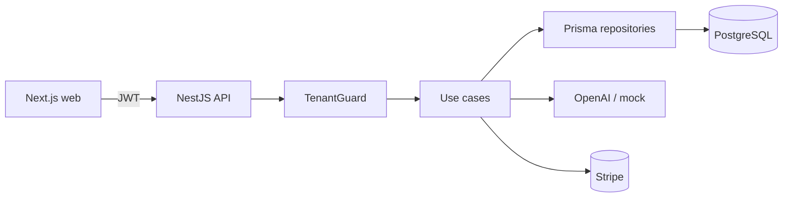

# AI SaaS Starter Kit

A production-grade, multi-tenant **AI SaaS** starter built as a Turborepo monorepo: streaming AI chat, organizations, Stripe billing and RBAC — engineered with **Domain-Driven Design** and **Clean Architecture**.

It runs **end-to-end with zero external accounts**: the AI chat falls back to a mock provider, billing runs in demo mode, and invitations work via copyable links. Add real keys (OpenAI, Stripe, Resend, OAuth) to light up each integration — every one degrades gracefully.

> **Stack:** Next.js 16 · NestJS 11 · Prisma + PostgreSQL · Redis · Stripe · OpenAI · Turborepo

---

## Try it in 60 seconds

**Requirements:** Node.js 20+, npm 10+, Docker (for PostgreSQL + Redis).

```bash
git clone <repo-url> ai-saas-kit && cd ai-saas-kit
npm install

# Env: API needs JWT secrets (generate with `openssl rand -base64 48`)
cp apps/api/.env.example apps/api/.env
cp apps/web/.env.local.example apps/web/.env.local

npm run db:up        # Postgres :5432 + Redis :6379 via Docker
npm run db:migrate   # apply schema
npm run db:seed      # demo account + sample conversations
npm run dev          # web :3000 · api :3001
```

Then open [http://localhost:3000](http://localhost:3000) and sign in with the seeded account:

| Email | Password |
|-------|----------|
| `demo@demo.com` | `demo1234` |

You land in a PRO workspace with sample conversations, can chat with the (mock) AI assistant, invite teammates by link, and explore billing — no API keys required.

---

## Features

- **Authentication** — Email/password with JWT access tokens + **rotating, hashed refresh tokens**; automatic silent refresh on the client; rate-limited auth routes.
- **Multi-tenancy** — Organization-scoped data with a `TenantGuard`; every tenant query filters by `organizationId`.
- **Streaming AI chat** — Real-time token streaming over **Server-Sent Events**; persistent history; per-plan message limits. Mock provider when no `OPENAI_API_KEY` is set (banner shown in UI).
- **Team management** — Invite teammates via **secure link** (email optional via Resend), manage roles (Owner / Admin / Member), enforce per-plan seat limits.
- **Billing** — Stripe checkout + customer portal, complete webhook handling (create/update/delete → plan sync + downgrade), per-plan usage limits. Demo mode without Stripe keys.
- **Plans & limits** — FREE / PRO / ENTERPRISE limits enforced in **domain entities** and guards; monthly usage reset via a scheduled cron.
- **Operability** — `GET /health` (DB + Redis), structured request logging with `x-request-id` correlation, global error contract.

## Tech stack

| Layer | Technology |
|-------|------------|
| Frontend | Next.js 16 (App Router), Tailwind, shared design system (`@repo/ui`) |
| API | NestJS 11 |
| Database | PostgreSQL via Prisma |
| Cache | Redis (ioredis) |
| AI | OpenAI (with mock fallback) |
| Payments | Stripe |
| Email | Resend (optional) |
| Monorepo | Turborepo + npm workspaces |

## Repository structure

```
ai-saas-kit/
├── apps/
│   ├── web/          # Next.js dashboard (port 3000)
│   ├── api/          # NestJS API (port 3001)
│   └── docs/         # Documentation site (port 3002)
├── packages/
│   ├── db/           # Prisma schema, client & seed
│   ├── shared/       # Shared types, plan limits, error codes
│   └── ui/           # Design system (shadcn-based)
└── docs/             # Markdown documentation & ADRs
```

## Architecture

Five bounded contexts (`auth`, `organization`, `billing`, `ai`, `user`), each a NestJS module structured as **domain → application → infrastructure → presentation**. The domain layer never imports Prisma, HTTP or third-party SDKs.



Request pipeline:

```
HTTP → ThrottlerGuard → JwtAuthGuard → TenantGuard → Controller → UseCase → Repository → DB
```

- **Multi-tenancy** — column-based (`organizationId`) with mandatory tenant filtering.
- **Streaming** — AI responses via SSE, not WebSockets (see ADR 003).
- **Usage** — counter on `Organization.messagesUsedThisMonth`, reset by cron (not COUNT-per-request).

Details: [Architecture](docs/architecture.md) · [ADRs](docs/adr/README.md).

## Development commands

```bash
npm run dev          # Start web + api (Turborepo)
npm run build        # Production build (all workspaces)
npm run lint         # ESLint across the monorepo
npm run check-types  # TypeScript project-wide
npm run test         # Unit tests (domain + plan limits)
npm run db:seed      # Reset demo data
```

Run a single app: `npx turbo dev --filter=web`

## Testing

- **Unit** — domain rules (`Conversation` entity, plan limits) run without a database: `npm run test`.
- **E2E** — auth flow (register / login / refresh) with Supertest against the live stack: `npm run test:e2e --workspace=api` (requires `db:up` + `db:migrate`).

## Configuration & integrations

All integrations are optional and degrade gracefully:

| Integration | Without keys | With keys |
|-------------|--------------|-----------|
| OpenAI | Mock streaming responses + UI banner | Live model streaming |
| Stripe | Demo mode (plans shown, checkout disabled) | Checkout, portal, webhooks |
| Resend | Invitations via copyable link | Invitation emails + link |
| OAuth | Email/password auth | Google / GitHub sign-in |

See [Environment variables](docs/environment.md) and [Getting started](docs/getting-started.md).

## Documentation

| Document | Audience |
|----------|----------|
| [Getting started](docs/getting-started.md) | Local setup |
| [Architecture](docs/architecture.md) | System design & request flow |
| [API reference](docs/api.md) | HTTP endpoints & response format |
| [Environment variables](docs/environment.md) | `.env` reference |
| [ADRs](docs/adr/README.md) | Architecture decision records |
| [AGENTS.md](AGENTS.md) | Guide for AI coding agents |

## License

Private / portfolio project — add your license here before distributing.
